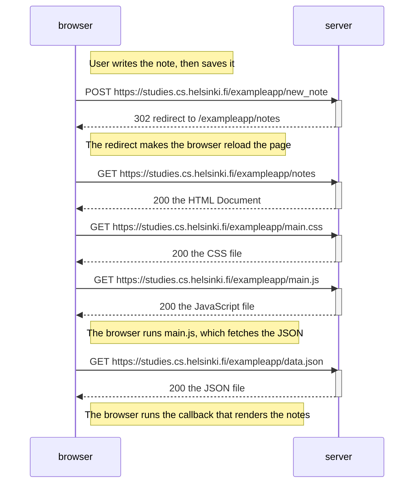

```mermaid 
sequenceDiagram 
    participant browser
    participant server

    Note right of browser: User writes the note, then saves it

    browser->>server: POST https://studies.cs.helsinki.fi/exampleapp/new_note
    activate server
    server-->>browser: 302 redirect to /exampleapp/notes
    deactivate server

    Note right of browser: The redirect makes the browser reload the page

    browser->>server: GET https://studies.cs.helsinki.fi/exampleapp/notes
    activate server
    server-->>browser: 200 the HTML Document
    deactivate server

    browser->>server: GET https://studies.cs.helsinki.fi/exampleapp/main.css
    activate server
    server-->>browser: 200 the CSS file
    deactivate server

    browser->>server: GET https://studies.cs.helsinki.fi/exampleapp/main.js
    activate server
    server-->>browser: 200 the JavaScript file
    deactivate server
    
    Note right of browser: The browser runs main.js, which fetches the JSON

    browser->>server: GET https://studies.cs.helsinki.fi/exampleapp/data.json
    activate server
    server-->>browser: 200 the JSON file
    deactivate server

    Note right of browser: The browser runs the callback that renders the notes
```
