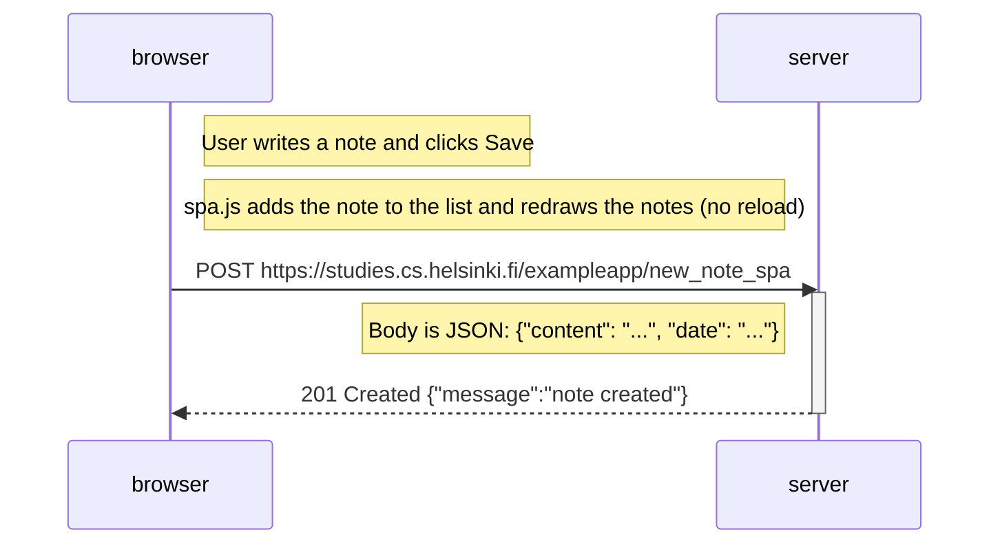

```mermaid
sequenceDiagram
    participant browser
    participant server

    Note right of browser: User writes a note and clicks Save
    Note right of browser: spa.js adds the note to the list and redraws the notes (no reload)

    browser->>server: POST https://studies.cs.helsinki.fi/exampleapp/new_note_spa
    activate server
    Note left of server: Body is JSON: {"content": "...", "date": "..."}
    server-->>browser: 201 Created {"message":"note created"}
    deactivate server
```
